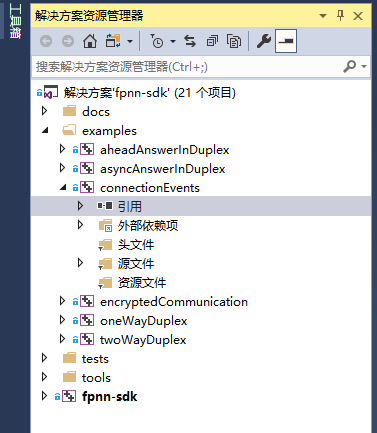
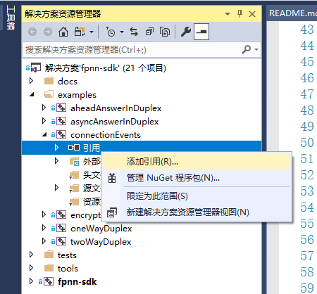
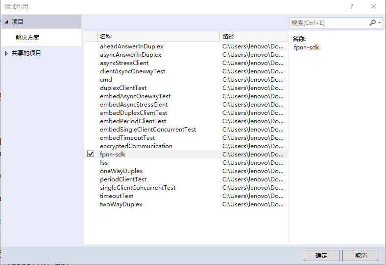
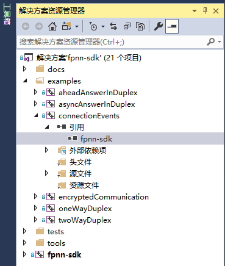
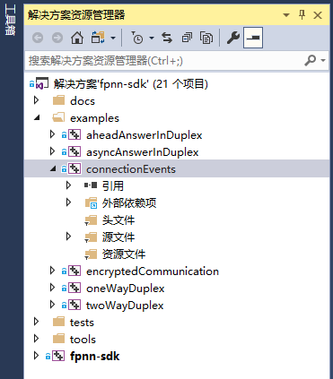
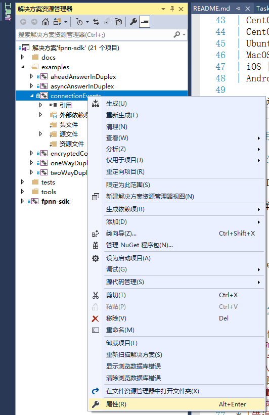
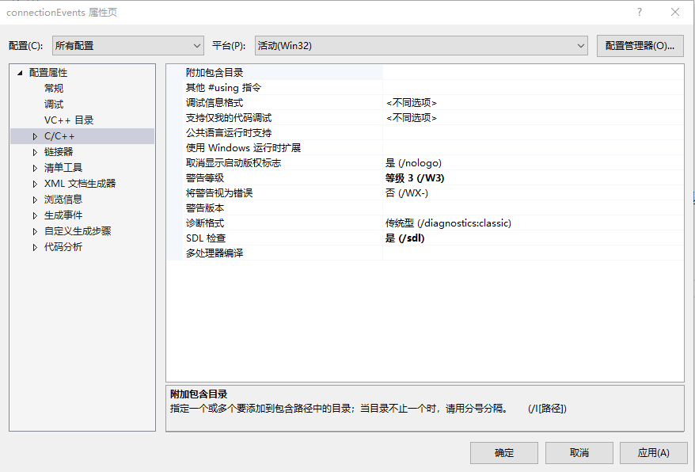
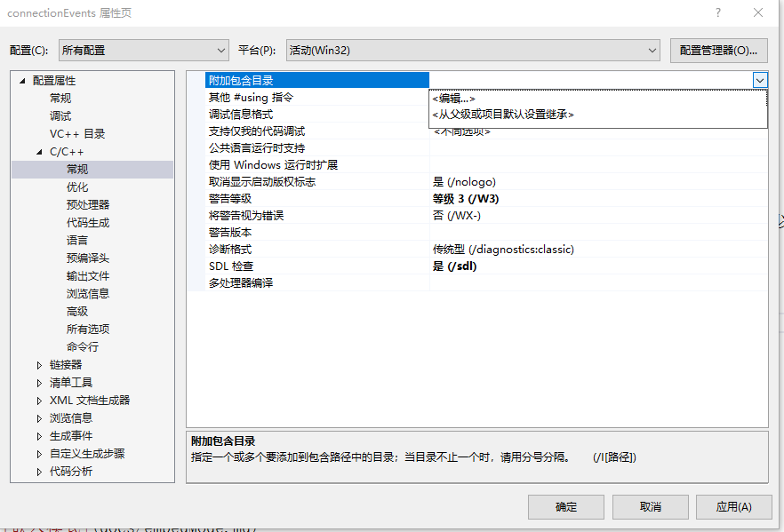
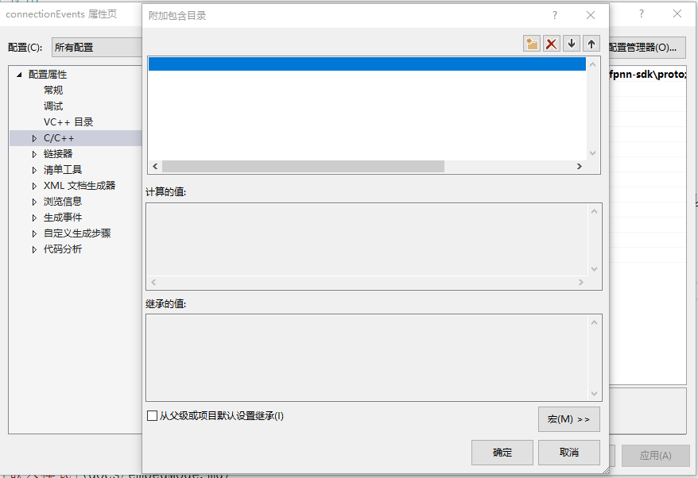
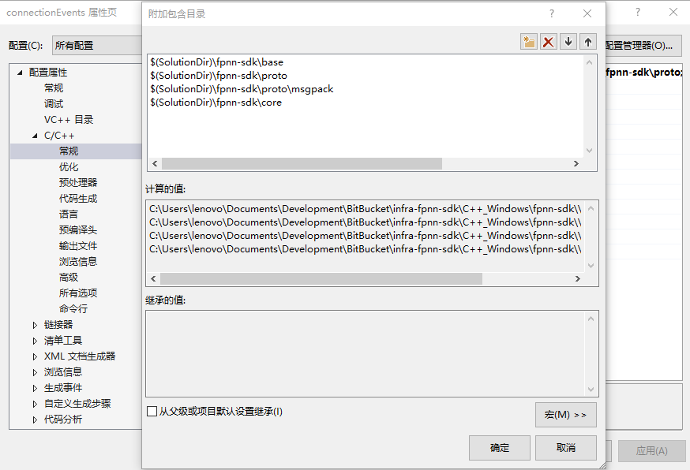

## SDK 使用配置

### 配置

以 FPNN Windows C++ SDK 自身解决方案自带的 [connectionEvents](../examples/connectionEvents) 项目为例：

1. 将 fpnn-sdk 项目加入解决方案

1. 添加引用

	1. 在“解决方案资源管理器”中，打开 connectionEvents 项目，如图所示：

		

	1. 鼠标右键点击 connectionEvents 项目下的“引用”条目，弹出右键菜单：

		

	1. 在项目“引用”条目的右键菜单中，选择“添加引用(R)...”，打开“添加引用对话框”。然后勾选“fpnn-sdk” 前的复选框，选中 “fpnn-sdk”，如图所示：

		

	1. 选择“确定”关闭对话框。此时“解决方案资源管理器”中，项目下的“引用”条目下，将出现 “fpnn-sdk” 的条目。如图所示：

		

1. 添加附加包含目录

	1. 在“解决方案资源管理器”中，打开 connectionEvents 项目，如图所示：

		

	1. 鼠标右键点击 connectionEvents 项目，弹出右键菜单：

		

	1. 在项目的右键菜单中，选择“属性”，打开项目属性对话框：

		

	1. 在项目属性对话框中，左上角“配置(C):”项，确认选择“所有配置”；

	1. 在项目属性对话框中，左侧选择：“配置属性” -> “C/C++” -> “常规”，打开“常规”选项页；

	1. 在“常规”选项页，选择“附加包含目录”，点击右侧表格单元，弹出下拉菜单：

		

	1. 点击下拉菜单中的“<编辑...>”条目，打开“附加包含目录”对话框：

		

	1. 点击“附加包含目录”对话框右上角“添加目录”图标，依次添加以下条目：

			$(SolutionDir)\fpnn-sdk\base
			$(SolutionDir)\fpnn-sdk\proto
			$(SolutionDir)\fpnn-sdk\proto\msgpack
			$(SolutionDir)\fpnn-sdk\core

		添加完毕后，如图所示：

		

	1. 点击“确定”，关闭“附加包含目录”对话框；

	1. 点击“应用”，保存编辑结果；

	1. 点击”确定“，关闭项目属性对话框。

### 关于杀毒软件

部分杀毒软件会将解决方案中编译出来的示例程序，或测试程序报告为病毒。

鉴于 FPNN SDK 已经向开发者提供了所有相关代码，相关被“错误识别”的“危害”和“风险”开发者可以自行确认。所以诸类杀毒软件的检测能力，相信开发者也会对其有新的认识。